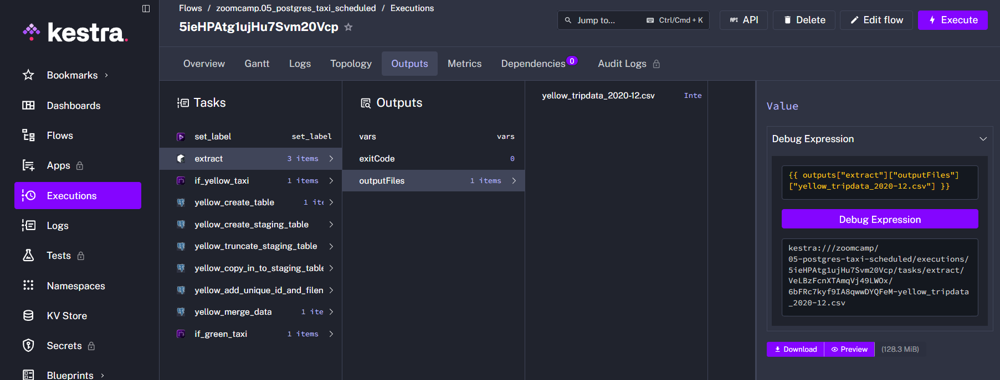
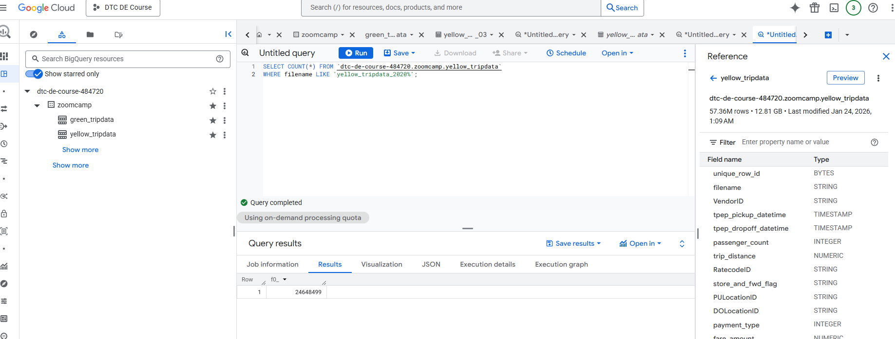
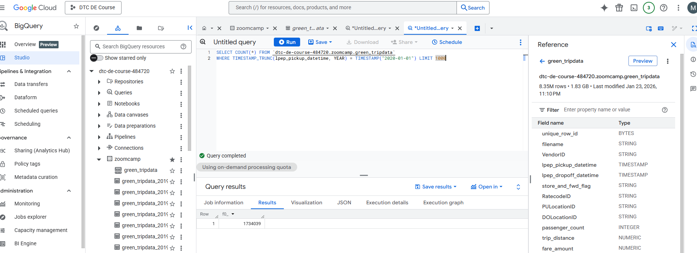
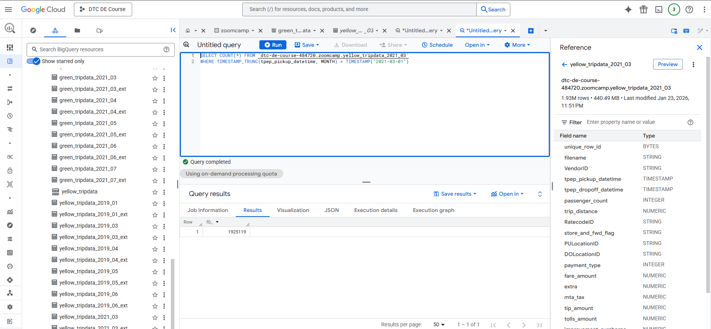
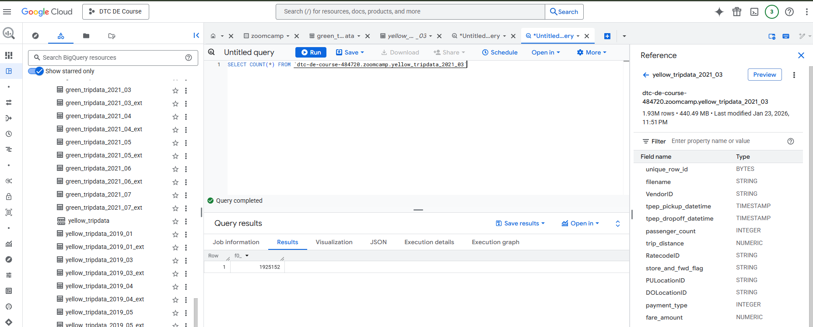
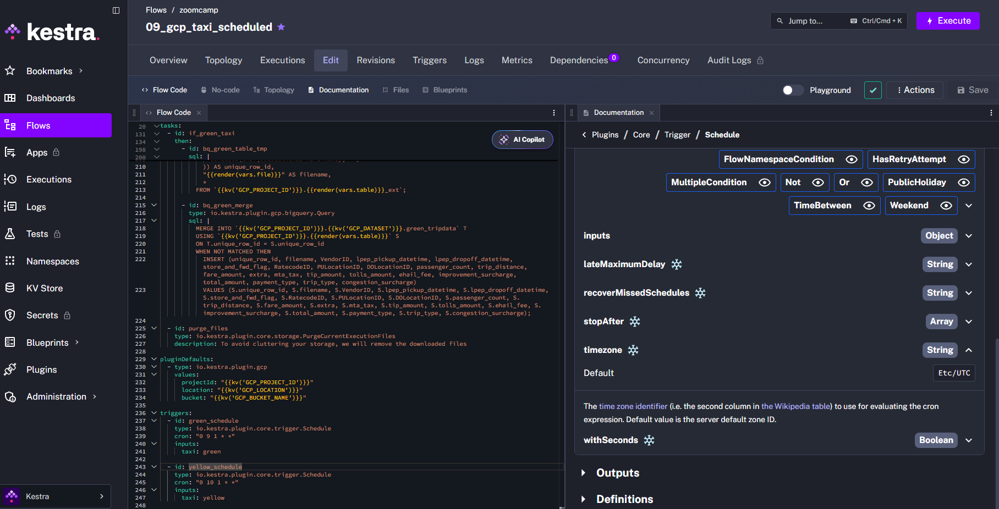
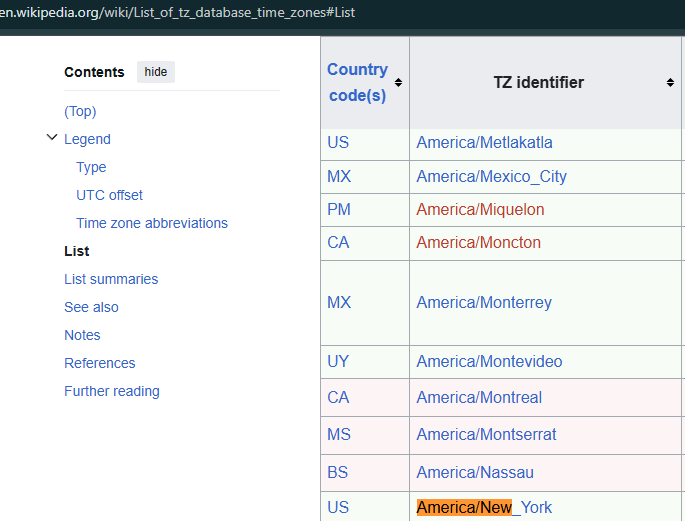

# Module 2 Homework - Workflow orchestration (Kestra, GCP)

This repository contains the code for solving the homework for Module 2. Answers have been transmitted via this [link](https://courses.datatalks.club/de-zoomcamp-2026/homework/hw2).
## Quiz Questions

1) Within the execution for `Yellow` Taxi data for the year `2020` and month `12`: what is the uncompressed file size (i.e. the output file `yellow_tripdata_2020-12.csv` of the `extract` task)?

- X 128.3 MiB (dowloaded with zoomcamp.05_postgres_taxi_scheduled scritp backfill)
- 134.5 MiB
- 364.7 MiB
- 692.6 MiB

2) What is the rendered value of the variable `file` when the inputs `taxi` is set to `green`, `year` is set to `2020`, and `month` is set to `04` during execution?
- `{{inputs.taxi}}_tripdata_{{inputs.year}}-{{inputs.month}}.csv` 
- X `green_tripdata_2020-04.csv`
- `green_tripdata_04_2020.csv`
- `green_tripdata_2020.csv`

3) How many rows are there for the `Yellow` Taxi data for all CSV files in the year 2020? (FROM BQ)
```sql
SELECT COUNT(*) FROM `dtc-de-course-484720.zoomcamp.yellow_tripdata`
WHERE filename LIKE 'yellow_tripdata_2020%';
```

- 13,537.299
- X 24,648,499
- 18,324,219
- 29,430,127

4) How many rows are there for the `Green` Taxi data for all CSV files in the year 2020? (FROM BQ) 

Query :
```sql
SELECT COUNT(*) FROM `dtc-de-course-484720.zoomcamp.green_tripdata` 
WHERE TIMESTAMP_TRUNC(lpep_pickup_datetime, YEAR) = TIMESTAMP("2020-01-01");
``` 
- 5,327,301
- 936,199
- X 1,734,051
- 1,342,034

5) How many rows are there for the `Yellow` Taxi data for the March 2021 CSV file? (FROM BQ)
- Be careful, it's just about the one CSV file not all rides in the month from all files!


Query :
```sql
SELECT COUNT(*) FROM `dtc-de-course-484720.zoomcamp.yellow_tripdata` 
WHERE TIMESTAMP_TRUNC(lpep_pickup_datetime, MONTH) = TIMESTAMP("2021-03-01");
```
- 1,428,092
- 706,911
- X 1,925,152
- 2,561,031

6) How would you configure the timezone to New York in a Schedule trigger? (FROM Kestra trigger Doc. + wikipedia timezone) 
 

- Add a `timezone` property set to `EST` in the `Schedule` trigger configuration  
- X Add a `timezone` property set to `America/New_York` in the `Schedule` trigger configuration (from docs/then wikipedia 2nd column)
- Add a `timezone` property set to `UTC-5` in the `Schedule` trigger configuration
- Add a `location` property set to `New_York` in the `Schedule` trigger configuration  

